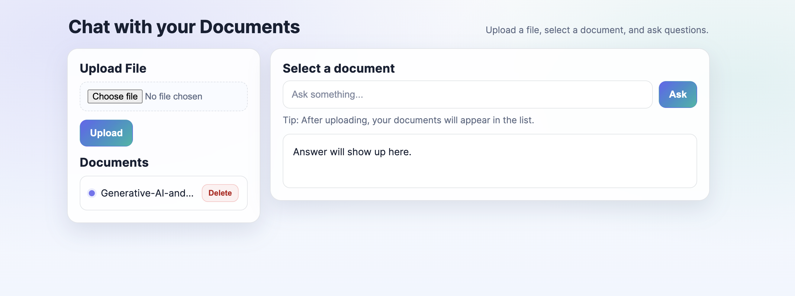
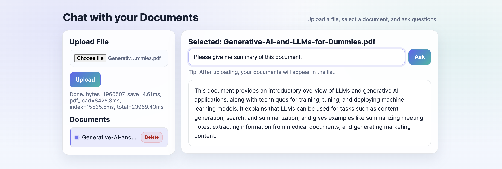

## RAG PDF Chat (learning project)

Live demo: [https://brilliant-tapioca-9a03b8.netlify.app/](https://brilliant-tapioca-9a03b8.netlify.app/)

This is a beginner-friendly RAG (Retrieval-Augmented Generation) project:

- Upload a **PDF**
- The backend extracts text, chunks it, embeds it, and stores vectors in **FAISS**
- You select a document and ask questions, answers are generated using only retrieved context.
- The UI returns concise answers in a simple chat-like interface.

---

## Screenshots




---

## Requirements

- Python 3.13 (recommended: use the provided `venv/`)
- An OpenAI API key in `.env`

Create a `.env` file in the project root:

```bash
OPENAI_API_KEY=your_key_here
```

---

## Setup

From the project root:

```bash
python -m venv venv
./venv/bin/python -m pip install -r requirements.txt
```

---

## Run the backend (FastAPI)

```bash
./venv/bin/python -m uvicorn app.main:app --reload --port 8000
```

Backend endpoints:

- `POST /upload` - Upload a PDF (`multipart/form-data`, field name: `file`)
- `GET /documents` - List available processed documents
- `POST /ask` - Ask a question for a selected doc (`JSON: { "q": "...", "doc_id": "..." }`)
- `DELETE /documents/{doc_id}` - Delete a document, its PDF, and its FAISS index

---

## Run the frontend

Open `frontend/index.html` in your browser.

If your browser blocks `file://` fetch calls, run a tiny local server:

```bash
cd frontend
python -m http.server 5173
```

Then open `http://localhost:5173` in your browser.

---

## Notes (for learning)

- Uploads are limited to 20 MB.
- Duplicate PDFs are detected via SHA-256 hash and reuse the existing index.
- Document list hides entries that don’t have a saved FAISS index.
- The system forces “I don’t know…” when retrieval looks weak (simple heuristic).

